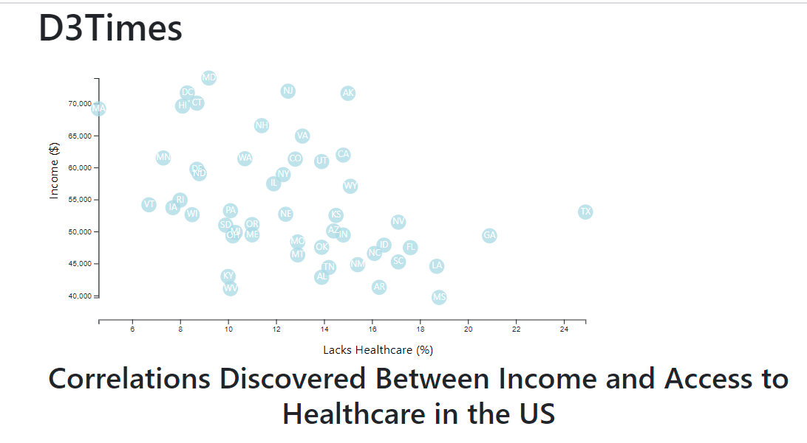

# d3-challenge

The data set included with the assignment is based on 2014 ACS 1-year estimates from the US Census Bureau.

We were tasked with creating a scatter plot between two of the data variables such as Healthcare vs. Poverty or Smokers vs. Age. I chose Income vs Access to Healthcare
Using the D3 techniques I learned in class, I created a scatter plot that represents each state with circle elements.The scatter plot ultimately appears like the image at the top of the page. I included:
<ul>
<li> state abbreviations in the circles. </li>
<li> axes and labels to the left and bottom of the chart.</li>
  </ul>

